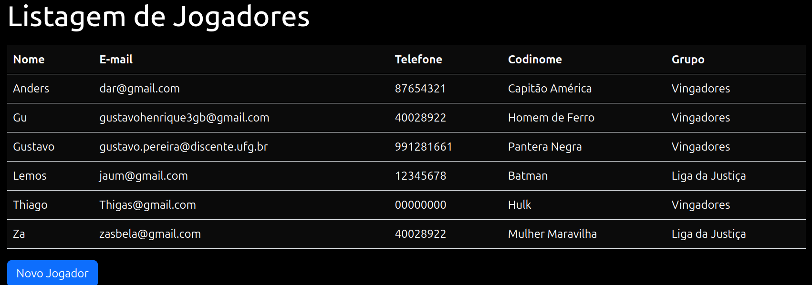
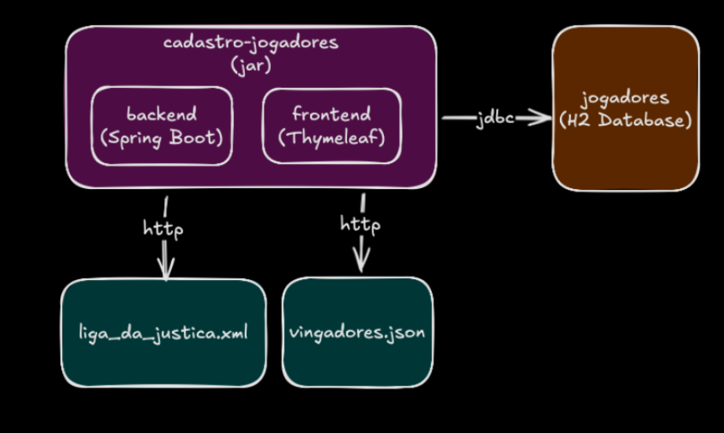

<h1 align="center">
    Codinome UOL
</h1>
<h2 align="center">
    sistema de cadastro de jogadores
</h2>

<p align="center">
  
</p>


<p align="center">
 
 
</p>

Esse projeto demonstra a resolução desse [desafio](https://github.com/uolhost/test-backEnd-Java.git) que propõe a criação de um sistema de cadastro de jogadores.

Essa aplicação faz a geração aleatória de codinomes de acordo com o grupo selecionado. ela é capaz de recuperar informações de um arquivo **XML** e de um arquivo **JSON**, persistir um cadastro em um banco de dados em arquivo.

## Funcionalidades

- [x] Cadastro de Jogador
- [x] Listagem de Jogador
- [x] Tela de Cadastro e Listagem
- [x] Validações e Tratamento de Exceções
- [x] Teste de Integração

## API 

### /listagem-jogadores


### /cadastro-jogador


## Arquitetura

O projeto foi elaborado seguindo a arquitetura sugerida no desafio, conforme imagem abaixo:



## Como executar

- Clonar repositório git:
```
git clone https://github.com/GustavoDaMassa/CodiNomeUol.git
```
- Construir o projeto:
```
./mvnw clean package
```
- Executar:
```
java -jar ./target/codiNomeUol-0.0.1-SNAPSHOT.jar
```

A tela inicial pode ser acessada em `http://localhost:8080/cadastro-jogador`.

## Tecnologias

- [Spring Boot](https://spring.io/projects/spring-boot)
- [Spring Web](https://docs.spring.io/spring-framework/reference/web.html)
- [Jdbc Client](https://docs.spring.io/spring-boot/reference/data/sql.html#data.sql.jdbc-client)
- [Rest Client](https://docs.spring.io/spring-framework/reference/integration/rest-clients.html#rest-restclient)
- [Thymeleaf](https://docs.spring.io/spring-framework/reference/web/webmvc-view/mvc-thymeleaf.html)
- [Spring Tests](https://docs.spring.io/spring-framework/reference/testing.html)
